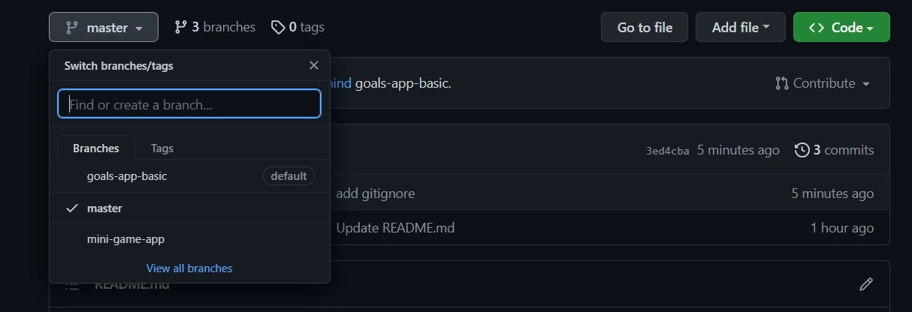

# React Native - The Practical Guide Code
Switch branches for another react native practice project:

## What learn from this project:
- Navigator with react-navigation
- Style Navigator and set title dynamic
- Use and extract params to get data (react-navigation)
- Add extra icon button in header
- Nested Navigator

#### Reference: 
*Udemy Course: "React Native - The Practical Guide [2023]", [Course Link Here](https://www.udemy.com/course/react-native-the-practical-guide/).*
